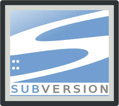
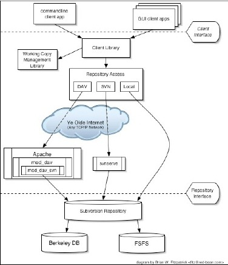

Control de Versiones Subversion
===============================

Introducción
------------

El control de versiones es el arte del manejo de los cambios en la información.
Ha sido durante mucho tiempo una herramienta crítica para los programadores, 
quienes normalmente empleaban su tiempo haciendo pequeños cambios en el software
y después des- haciendo esos cambios al día siguiente. 

Pero la utilidad del software de control de versiones se extiende más allá de 
los límites del mundo del desarrollo de software. Allá donde pueda encontrarse 
a gente usando ordenadores para manejar información que cambia a menudo, hay un hueco para el control de versiones. 

Y aquí es donde entra en juego Subversion.

Subversion es un sistema centralizado de control de versiones. En otras palabras, es un sistema que permite llevar el control de los cambios realizados por una o más personas a una serie de documentos a través del tiempo.

En un proyecto podemos tener muchos documentos de diversos tipos, como *HTML* o código de *Phyton*. Los documentos pueden estar cambiando constantemente y ser modificados por diversas personas. En el ciclo de trabajo diario, esta situación puede ocasionar cambios perdidos y severos problemas de coordinación, lo que degenera en tiempo perdido y baja de productividad para todos los miembros del equipo de desarrollo.

Un sistema de control de versiones se encarga de llevar el control de todas estas modificaciones a los documentos del proyecto. Un desarrollador solamente tiene que encargarse de guardar sus cambios al proyecto y el sistema se ocupa de integrarlos con los cambios de los otros miembros del equipo y de asegurarse de que no existan conflictos.

Adicionalmente, utilizar un sistema de control de versiones nos permite cosas como comparar la más reciente versión de un documento con versiones anteriores, identificar quien ha realizado cuales cambios en el código y designar un conjunto de documentos específicos como una 'entrega' del proyecto que queda identificada con las versiones de cada uno de los documentos en el instante de la definición.

##Historia

A principios de 2000, *CollabNet, Inc*. (http://www.collab.net) comenzó a 
buscar a los desarrolladores para escribir un sustituto para **CVS**.

CollabNet ofrece una suite de software de colaboración denominado CollabNet 
Enterprise Edition (CEE), de los cuales uno de los componentes era el control 
de versiones. Aunque CEE utiliza CVS como su sistema de control de versiones 
inicial, las limitaciones de CVS eran evidentes desde el principio, y CollabNet
 sabía que tendría que encontrar algo mejor. 

Desafortunadamente, CVS se había convertido en el estándar de facto en el mundo
 del código abierto en gran medida porque no había nada mejor, al menos no bajo
 una licencia libre. Así CollabNet decidió escribir un nuevo sistema de control
 de versiones desde cero, manteniendo las ideas básicas de CVS, pero sin sus 
fallos y defectos.

En febrero de 2000 contactaron a Karl Fogel ofreciendole trabajar en el 
proyecto. Coincidentemente Karl y su amigo Jim Blandy habian discutido el 
diseño deun nuevo sistema de control de versiones. Jim habia pensado 
cuidadosamenre acerca de mejores formas de administrar datos versionados y ya 
habia llegado al nombre de **subversion** y al **diseño basico del almacen de 
datos** del mismo.

Cuando CollabNet llamó, Karl acepto inmediatamente trabajar en el proyecto y 
Jim consiguio que su empresa, Red Hat Software, le donara escencialmente al 
proyecto por un periodo de tiempo indefinido.

CollabNet contrató a **Karl** y a **Ben Collins-Sussman**, y el trabajo de 
diseño detallado se inició en mayo de 2000. 

Con la ayuda de algunos estimulos bien colocados de Brian Behlendorf y Jason 
Robbins de CollabNet, y desde Greg Stein, **Subversion** atrajo rápidamente a 
una comunidad de desarrolladores activos. Resultó que muchas personas habian 
encontrado las mismas experiencias frustrantes con CVS y dio a la bienvenida a 
la oportunidad de finalmente hacer algo al respecto.

El equipo de diseño original establecio algunos objetivos simples:

* No querian abrir nuevos caminos en la metodologia decontrlo de versiones,sólo
querian corregir CVS.
* Decidieron que Subversion corresponderia con las mismas caracteristicas de CVS.
* Conservar el mismo modelo de desarrollo, pero sin duplicar los defectos de 
CVS.
* Debia ser lo suficientemente similar a CVS, para que cualquier usuario del 
mismo pudiera hacer el cambio con poco esfuerzo.

Despues de 14 meses de codificación, Subversion se convirtio en 
“**self-hosting**” el 31 de agosto de 2001. Es decir, los desarrolladores de 
Subversion dejaron de usar **CVS** para gestionar su propio código fuente de 
*Subversion* y empezaron a usar **Subversion** en su lugar.

Mientras CollabNet comenzó el proyecto, y todavia financiaba una gran parte de 
la obra, Subversion funciona como la mayoria de los proyectos de código abierto.

En 2009, CollabNet trabajó con los desarrolladores de Subversion para alcanzar 
el objetivo de integrar el proyecto Subversion a la **Apache Software 
Foundation** (ASF), uno de los colectivos más conocidos de proyectos de código 
abierto en el mundo.

Raíces de Subversion, las prioridades de la comunidad y las prácticas de 
desarrollo eran un ajuste perfecto para la ASF, muchos de cuyos miembros ya 
eran contibuyentes activos de Subversion.

A principios de 2010, *Subversion* fue plenamente adoptado en la familia de la 
*ASF* de proyectos de primer nivel, se trasladó su proyecto de presencia en la 
web para http://subversion.apache.org, y fue rebautizado "**Apache 
Subversion**".

## Características ##

Subversión proporciona:
- **Versionado de directorios**
Subversion implementa un sistema de ficheros versionado “virtual ” que sigue 
los cambios sobre árboles de directorios completos a través del tiempo. Ambos, 
ficheros y directorios, se encuentran bajo el control de versiones.

- **Verdadero historial de versiones**
Con Subversion, usted puede añadir, borrar, copiar, y renombrar ficheros y
directorios. Y cada fichero nuevo añadido comienza con un historial nuevo, 
limpio y completamente suyo.

- **Envíos atómicos**
Una colección cualquiera de modificaciones o bien entra por completo al 
repositorio, o bien no lo hace en absoluto. Ésto permite a los desarrolladores
construir y enviar los cambios como fragmentos lógicos e impide que ocurran 
problemas cuando sólo una parte de los cambios enviados lo hace con éxito.

- **Versionado de metadatos**
Cada fichero y directorio tiene un conjunto de propiedades; claves y sus 
valores asociado a él. Usted puede crear y almacenar cualquier par arbitrario 
de clave/valor que desee. Las propiedades son versionadas a través del tiempo, 
al igual que el contenido de los ficheros.

- **Elección de las capas de red**
Subversión tiene una noción abstracta del acceso al repositorio, facilitando a 
las personas implementar nuevos mecanismos de red. Subversion puede conectarse 
al servidor HTTP Apache como un módulo de extensión. Ésto proporciona a 
Subversión una gran ventaja en estabilidad e interoperabilidad, y acceso 
instantáneo a las características existentes que ofrece este 
servidor—autenticación, autorización, compresión de la conexión, etcétera. 
También tiene disponible un servidor de Subversión independiente, y más ligero. 
Este servidor habla un protocolo propio, el cual puede ser encaminado fácilmentea través de un túnel SSH.

- **Manipulación consistente de datos**
Subversión expresa las diferencias del fichero usando un algoritmo de 
diferenciación binario, que funciona idénticamente con ficheros de texto 
(legibles para humanos) y ficheros binarios (ilegibles para humanos). Ambos 
tipos de ficheros son almacenados igualmente comprimidos en el repositorio, 
y las diferencias son transmitidas en ambas direcciones a través de la red.

- **Ramificación y etiquetado eficientes**
El coste de ramificación y etiquetado no necesita ser proporcional al tamaño delproyecto. Subversión crea ramas y etiquetas simplemente copiando el proyecto, 
usando un mecanismo similar al enlace duro. De este modo estas operaciones tomansolamente una cantidad de tiempo pequeña y constante.

- **Hackability**
Subversión no tiene un equipaje histórico; está implementado como una colección de bibliotecas compartidas en C con APIs bien definidas. Ésto hace a Subversión extremadamente fácil de mantener y reutilizable por otras aplicaciones y lenguajes.

- **Arquitectura de Subversión**

**Comandos y su descripción.**

A continución alistaremos los comandos básicos para el uso de Subversion, así como su descripción y su sintaxis.

1. **Ayuda.**
Este comando nos sirve para ver la ayuda necesaria para el uso de un comando y su sintaxis es la siguiente:
$ svn help subcomando

	Donde Subcomando es el comando para el cual requerimos ayuda.

2. **Subir los cambios**
El siguiente comando es CI el cual utilizaremos para compartir los cambios con los demás desarrolladores, su sintaxis es:
$ svn ci

3. **Agregar un archivo.**
Para agregar un archivo o una carpeta y todo su contenido al control de versiones se usa el subcomando add, su sintaxis es la siguiente:
$ svn add archivo.src carpeta/

4. **Borrar un archivo.**
De la misma manera en que se agrega un archivo para borrar es algo similar, su sintaxis es la siguiente:
$ svn delete archivo.src carpeta/

5. **El comando update.**
Nos sirve para asegurar que despues de dejar de trabajar con un repositorio y retomarlo tiempo despues, sea la ultima copia del repositorio, su sintaxis es
$ svn update

6. **Cambios.**
Para observar el historial de cambios y saber que usuario modificó el archivo podemos utilizar el siguiente comando:
$ svn log

7. **Diferencias entre versiones.**
Si queremos encontrar los cambios que se han realizado en un archivo en particular entre la versión actual y la anterior podemos usar el comando diff, su sintaxis es la siguiente:
$svn diff nombre_archivo

8. **Exportar.**
Si se desea trabajar con unn archivo fuera del ambiente subversion, se pueden exportar con el siguiente comando:
$ svn export carpeta_origen carpeta_destino

9. **Etiquetar versión.**
Si se desea hacer el etiquetado de una nueva versión y estabilizar los cambios de la rama trunk podemos utilizar el siguiente comando:
$ svn copy nombre del repo/trunk -r #revisión nombre del repo/tags/nombre de la etiqueta -m "comentario".

10. **Excluir archivos.**
Si se desea excluir archivos generados manualmente y no se quieren subir al repositorio podemos agregarlos a la lista de exclusión con el siguiente comando:
$ svn propedit svn:ignore

>* Andy Daniel Cruz Ramos
>* Mónica Conde Domínguez
>* Luisa Cerón Perea
>* Edilzar Cisneros Ancheyta
>* Juliana Yarid Castro Rodríguez

